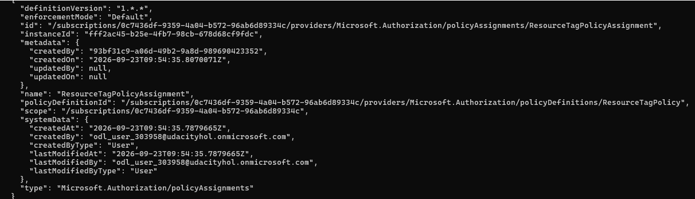
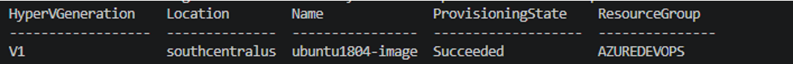
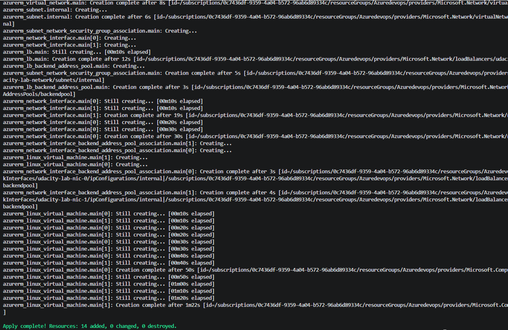
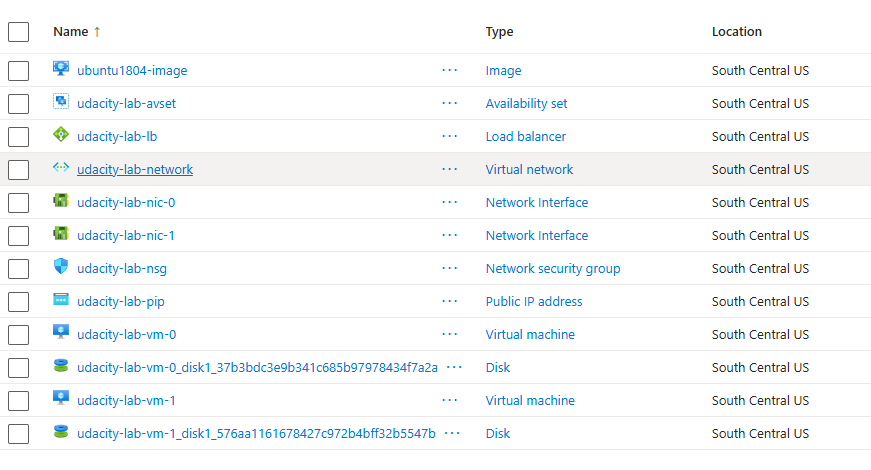
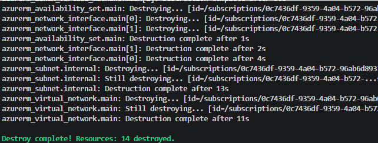

# Azure Infrastructure Operations Project: Deploying a scalable IaaS web server in Azure

### Introduction
For this project, you will write a Packer template and a Terraform template to deploy a customizable, scalable web server in Azure.

### Getting Started
1. Clone this repository

2. Create your infrastructure as code

3. Update this README to reflect how someone would use your code.

### Dependencies
1. Create an [Azure Account](https://portal.azure.com) 
2. Install the [Azure command line interface](https://docs.microsoft.com/en-us/cli/azure/install-azure-cli?view=azure-cli-latest)
3. Install [Packer](https://www.packer.io/downloads)
4. Install [Terraform](https://www.terraform.io/downloads.html)

### Instructions

## Setup

### Authenticate to Azure

Sign in to Azure using the Azure CLI:

```powershell
az login
```

Verify the correct subscription is selected:

```powershell
az account show
```

---

### Deploy Azure Policy

Create the policy definition:

```powershell
az policy definition create `
  --name ResourceTagPolicy `
  --display-name "Deny creation of resources without tags" `
  --mode Indexed `
  --rules .\policy-rule.json
```

Assign the policy:

```powershell
az policy assignment create `
  --name ResourceTagPolicyAssignment `
  --policy ResourceTagPolicy
```

---

### Build the Packer Image

Initialise the Azure Packer plugin:

```powershell
packer init .
```

Build the custom Ubuntu image:

```powershell
packer build server.json
```

After a successful build, verify the image was created:

```powershell
az image show `
  --name ubuntu1804-image `
  --resource-group Azuredevops
```

---

### Deploy Infrastructure with Terraform

Initialize Terraform:

```powershell
terraform init
```

Validate the configuration:

```powershell
terraform validate
```

Generate an execution plan in HCL folder:

```powershell
terraform plan -out solution.plan
```

Deploy the infrastructure:

```powershell
terraform apply solution.plan
```

---

### Destroy Infrastructure

Remove all deployed infrastructure:

```powershell
terraform destroy
```


---
## Customisation
You can customise deployment by modifying the vars.tf file.

The folloiwng variables can be updated

### Prefix
Resource naming prefix used when creating Azure resources
Example
```hcl
prefix = "webapp"
prefix = "dev"
```

### Location
Default location
```hcl
location = "East US"
```

Other valid locations 
```hcl
location = "West Europe"
location = "UK South"
location  = "South Central US"
```

### Resource Group Name
The name of an exisiting Azure Resource Group where the resources will be deployed.

Example 
```hcl
resource_group_name = "Azuredevops"
```

### Admin Username 
The administator username for the virtual machines 

Example values
```hcl
admin_username = "azureuser"
admin_username = "vmadmin"
```
Note: Azure reserves certain usernames such as admin, administrator and root. Thherefore, those cannot be used.

### Admin Password 
The administrator password for the virtual machines.
Note: The password must meet Azure VM password complexity requirements.

### VM Count 
The number of virtual machines to deploy

Default value 
```hcl
vm_count = 2 
```


## Output
### Policy


### Packer image


### Infrastructure with Terraform 





